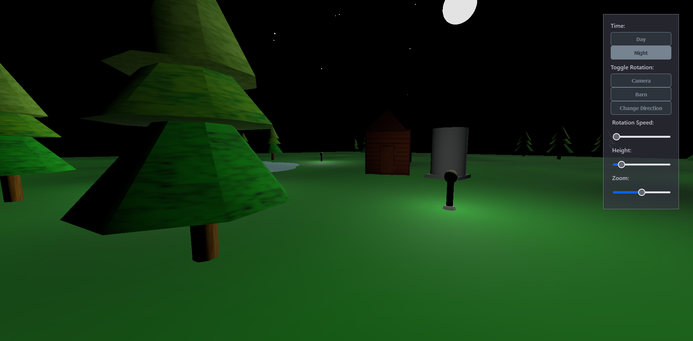
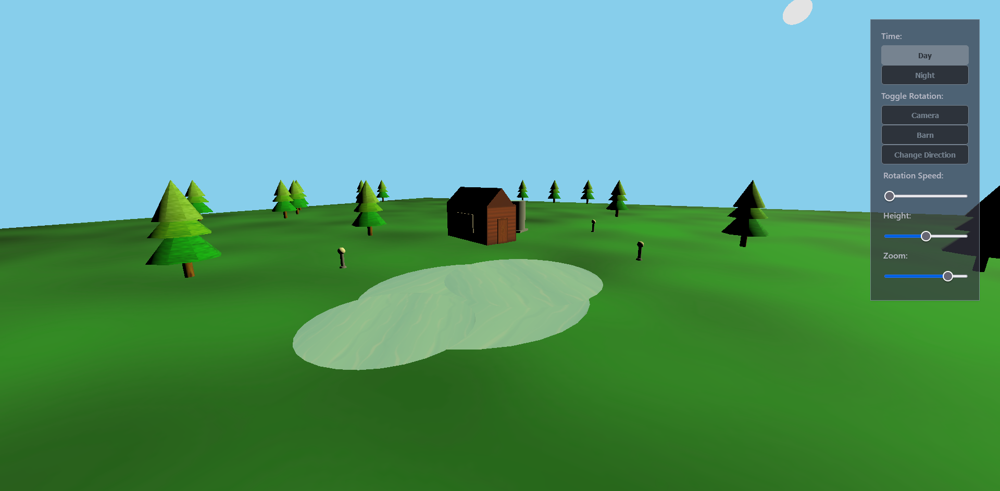
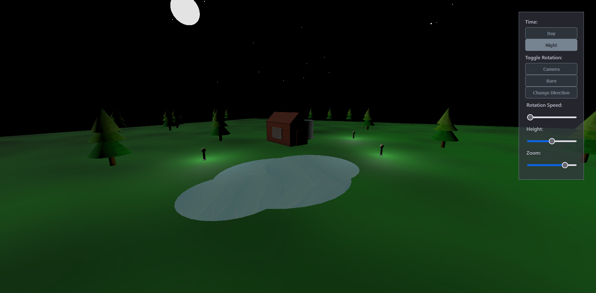

<!-- PROJECT SHIELDS -->
[![Contributors][contributors-shield]][contributors-url]
[![Forks][forks-shield]][forks-url]
[![Stargazers][stars-shield]][stars-url]
[![Issues][issues-shield]][issues-url]
[![MIT License][license-shield]][license-url]

<!-- Title -->
 
<h3 align="center">WebGL Village Project</h3>

  Test and demonstration of WebGL with JS 3 
  Design and construct a simple village with interactive features 
  <a href="#usage">View Demo</a>
  ·
  <a href="https://github.com/Thorin-the-Bearded/ComputerGraphicsVillage/issues">Report Bug</a>
  ·
  <a href="https://github.com/Thorin-the-Bearded/ComputerGraphicsVillage/issues">Request Feature</a>

<!-- TABLE OF CONTENTS -->

Table of Contents

<ol>
  <li><a href="#introduction">Introduction</a></li>
  <li><a href="#project-structure">Project Structure</a></li>
  <li><a href="#features">Features</a></li>
  <li><a href="#usage">Usage</a></li>
  <li><a href="#screenshots">Screenshots</a></li>
  <li><a href="#resources">Resources</a></li>
  <li><a href="#acknowledgments">Acknowledgments</a></li>
  <li><a href="#license">License</a></li>
</ol>

<!-- Introduction -->
## Introduction
This project is a test and demonstration of WebGL with JS 3. It involves designing and constructing a simple village using WebGL. The village consists of various elements such as a water tank, a barn, and trees. The project also includes buttons and sliders for interactive features like rotation and zooming.

<!-- Project Structure -->
## Project Structure
- `index.html`: The main HTML file that displays the WebGL scene.
- `style.css`: CSS file for styling the HTML elements.
- `script.js`: JavaScript file containing the WebGL code and logic.
- `textures/`: Directory containing textures used in the project.
- `screenshots/`: Directory to store screenshots of the running program.

<!-- Features -->
## Features
- Water Tank: A cylinder-shaped water tank is rendered in the scene.
- Barn: A rectangular structure with a prism roof represents a barn.
- Trees: Trees are rendered using cylinders for trunks and cones for the top half of the tree.
- Ground and Water Pond: The ground is defined, and a water pond is drawn on the ground.
- Buttons:
  - Toggle Rotation: Starts and stops the rotation of shapes in the village.
  - Toggle Direction: Changes the direction of rotation.
- Sliders:
  - Speed Control: Increases or decreases the speed of rotation of shapes.
  - Zoom Control: Allows zooming in or out to the center of the village.

<!-- Usage -->
## Usage
To run the WebGL village project, follow these steps:
1. Download the project ZIP folder and extract it to a local directory.
2. Open the extracted folder in a code editor or IDE.
3. Open the `index.html` file in a web browser.
4. The WebGL village scene will be displayed, and you can interact with the buttons and sliders as described in the features section.

<!-- Screenshots -->
## Screenshots

<!-- Resources -->
## Resources
The project utilizes the following resources:
- WebGL: A web graphics API for rendering interactive 2D and 3D graphics.
- JS3: JavaScript library for creating WebGL applications.
- Three.js: A JavaScript 3D library that simplifies WebGL programming.

<!-- License -->
## License
This project is licensed under the [MIT License](LICENSE).

<!-- Links -->
[contributors-shield]: https://img.shields.io/github/contributors/Thorin-the-Bearded/ComputerGraphicsVillage.svg?style=for-the-badge
[contributors-url]: https://github.com/Thorin-the-Bearded/ComputerGraphicsVillage/graphs/contributors
[forks-shield]: https://img.shields.io/github/forks/Thorin-the-Bearded/ComputerGraphicsVillage.svg?style=for-the-badge
[forks-url]: https://github.com/Thorin-the-Bearded/ComputerGraphicsVillage/network/members
[stars-shield]: https://img.shields.io/github/stars/Thorin-the-Bearded/ComputerGraphicsVillage.svg?style=for-the-badge
[stars-url]: https://github.com/Thorin-the-Bearded/ComputerGraphicsVillage/stargazers
[issues-shield]: https://img.shields.io/github/issues/Thorin-the-Bearded/ComputerGraphicsVillage.svg?style=for-the-badge
[issues-url]: https://github.com/Thorin-the-Bearded/ComputerGraphicsVillage/issues
[license-shield]: https://img.shields.io/github/license/Bearded-Viking/TaskFlow.svg?style=for-the-badge
[license-url]: https://github.com/Thorin-the-Bearded/ComputerGraphicsVillage/blob/master/LICENSE
